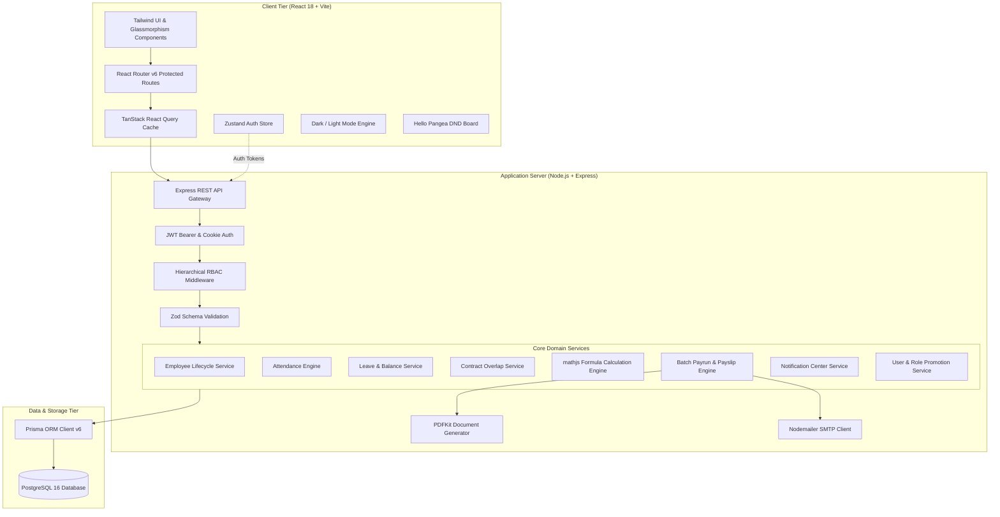

<div align="center">

# 🚀 PeoplePay360
### *Next-Gen Autonomous HR, Dynamic Payroll & Workforce Intelligence Platform*

[](#)
[](https://opensource.org/licenses/MIT)
[](https://nodejs.org/)
[](https://react.dev/)
[](https://www.prisma.io/)
[](https://www.postgresql.org/)
[](https://tailwindcss.com/)

<p align="center">
  <strong>Transforming archaic spreadsheets and disjointed HR apps into a unified, mathematically rigorous, and delightful employee operations ecosystem.</strong>
</p>

[📌 Problem Statement](#-the-problem) •
[💡 The Solution](#-the-solution) •
[✨ Key Innovations](#-key-innovations--features) •
[🏗 Architecture](#-architecture--system-design) •
[⚡ Quick Start (3 Mins)](#-quick-start--installation) •
[🔑 Demo Credentials](#-demo-accounts-for-judges) •
[🗺 Roadmap](#-future-roadmap)

</div>

---

## 📌 The Problem

Organizations today waste hundreds of operational hours wrestling with fragmented workforce systems:

- ❌ **Spreadsheet Chaos & Formula Drift**: Payroll teams manually edit complex tax, deduction, and allowance calculations in disconnected Excel sheets, leading to costly compliance and disbursement errors.
- ❌ **Contract Overlap & Disconnect**: Lack of database-level constraints permits overlapping active contracts, inconsistent shift assignments, and disputed wage baselines.
- ❌ **Biometric & Attendance Silos**: Punch logs from web, mobile, or hardware devices are trapped in separate tools, making overtime and deficit calculations a manual nightmare.
- ❌ **Lack of True Self-Service**: Employees must email HR for routine tasks like payslip downloads, leave balances, or attendance corrections.
- ❌ **Security & Privilege Leaks**: Traditional platforms lack granular hierarchical guards, allowing accidental self-promotions or disastrous deactivation of the last system administrator.

---

## 💡 The Solution

**PeoplePay360** is a full-stack, domain-driven HR & Payroll intelligence engine engineered to solve workforce operations end-to-end:

1. **Dynamic Salary Formula Engine**: Write complex mathematical compensation rules using custom algebraic formulas (`mathjs`) evaluated on the fly—no hardcoding required.
2. **Ironclad Role Hierarchy & Safeguards**: 5-tier role hierarchy (`EMPLOYEE < HR_MANAGER < HR_PAYROLL_USER < HR_PAYROLL_MANAGER < ADMIN`) with server-enforced safeguards preventing self-promotions, privilege escalations, and last-admin lockouts.
3. **Interactive Lifecycle Kanban**: Drag-and-drop employee state transitions (`ONBOARDING` $\rightarrow$ `ACTIVE` $\rightarrow$ `ON_NOTICE` $\rightarrow$ `SUSPENDED` $\rightarrow$ `EXITED`) with real-time optimistic cache updates.
4. **Automated Batch Payrun Disbursal**: Draft, recompute, confirm, and disburse company-wide payroll in one click with automated PDF payslip generation (`PDFKit`) and instant SMTP email dispatch (`Nodemailer`).
5. **Omni-Channel Attendance Tracking**: Web clock, mobile punch, biometric integration, automatic schedule deficit computation, and manager correction workflows.
6. **Unified Self-Service Portal (ESS)**: Empower employees to punch attendance, track leave balances, submit requests, and access encrypted historical payslips.

---

## ✨ Key Innovations & Features

### 🧮 1. Dynamic Formula-Based Salary Rule Engine
- Build flexible salary structures (`Basic`, `Allowance`, `Gross`, `Deduction`).
- Multiple computation modes: **Fixed Amount**, **Percentage of Code** (e.g., $40\%$ of `BASIC`), or **Dynamic Formula** (e.g., `(GROSS - HRA) * 0.12`).
- Safe algebraic expression evaluation via `mathjs` with dependency sequence reordering.

### 🛡 2. 5-Tier RBAC & Enterprise Security Safeguards
```
EMPLOYEE (Level 0)  <  HR_MANAGER (Level 1)  <  HR_PAYROLL_USER (Level 2)  <  HR_PAYROLL_MANAGER (Level 3)  <  ADMIN (Level 4)
```
- **Self-Promotion Guard**: Users are strictly blocked from altering their own role at any level.
- **Hierarchical Ceiling**: Actors can only promote or demote users strictly below their hierarchy level and cannot assign roles equal to or higher than their own.
- **Last Active Admin Guard**: Prevents demoting or deactivating the final active administrator, eliminating catastrophic system lockout risks.
- **Instant Query Invalidation**: Immediate TanStack Query cache invalidation so role updates and status transitions reflect across the UI with zero manual page reloads.

### 📋 3. Interactive Employee Directory & Kanban Board
- **Sortable High-Density Table**: Instant multi-keyword search across code, email, name, and department with multi-status filters.
- **Fluid Drag-and-Drop Kanban**: Powered by `@hello-pangea/dnd` for visual employee lifecycle management with rollback on error.
- **360° Profile Dossier**: Statutory records (PAN, Aadhaar, UAN, PF, ESIC, Bank Account & IFSC) alongside linked active contracts, attendance history, and time-off balances.

### ⏱ 4. Shift Scheduling & Attendance Engine
- **Custom Working Schedules**: Design flexible 40h/week shifts, weekend rotations, or customized office hours with daily line definitions.
- **Smart Attendance Classifications**: Automatically detects `PRESENT`, `LATE`, `EARLY_LEAVE`, `HALF_DAY`, `OVERTIME`, `MISSING_CHECKOUT`, and `ON_LEAVE`.
- **Correction Request Pipeline**: Self-service correction submissions with supervisor review and audit trail.

### 📄 5. Overlap-Proof Employment Contracts
- Complete contract lifecycle tracking (`DRAFT`, `ACTIVE`, `EXPIRED`, `TERMINATED`, `CANCELLED`).
- **PostgreSQL Partial Unique Constraints**: Physically prevents overlapping active contracts for any employee at the database level.
- Tri-link binding connecting Employee $\leftrightarrow$ Salary Structure $\leftrightarrow$ Working Schedule.

### 💳 6. One-Click Batch Payrun Disbursals
- **Batch Processing**: Automatically pulls active contracts, aggregates worked days from attendance, computes dynamic earnings/deductions, and generates itemized payslip lines.
- **Dynamic PDF Generation**: Compiles professional, print-ready PDF payslips with high-fidelity formatting using `PDFKit`.
- **Direct Email Dispatch**: Dispatches payslip PDFs directly to employee inboxes via `Nodemailer` upon marking payrun as `PAID`.

### 🔔 7. Real-Time In-App Notification Center
- Notification bell with unread badge counter in top bar.
- Automated alert triggers on leave approval/refusal, contract expiration warnings, role promotions, and payrun completion.
- Categorized feeds with one-click "Mark All as Read" action.

### 🌓 8. Theme System (Dark / Light Mode)
- Custom-tailored dark mode and clean corporate light mode built into CSS variables and Tailwind tokens.
- Persistent theme preferences across sessions via local storage and system theme auto-sync.

---

## 🏗 Architecture & System Design



---

## 🛠 Technology Stack

| Domain | Tech | Purpose in PeoplePay360 |
| :--- | :--- | :--- |
| **Frontend Framework** | React 18 + Vite 5 | High-speed component rendering and blazing fast HMR |
| **Styling & Theming** | Tailwind CSS 3.4 | Utility-first responsive design with custom Dark/Light palette |
| **Client State & Cache** | TanStack Query v5 | Server state caching, optimistic updates & automated invalidation |
| **Auth State** | Zustand | Lightweight, persistent client authentication store |
| **Data Visualization** | Recharts 3.10 | Interactive salary trends, attendance ratios & department costs |
| **Drag & Drop** | `@hello-pangea/dnd` | Accessible, responsive drag-and-drop employee Kanban board |
| **Form Validation** | React Hook Form + Zod | Strict client-side and server-side schema validation |
| **Backend Runtime** | Node.js (ESM) + Express | RESTful API services and domain-driven controllers |
| **Database & ORM** | PostgreSQL + Prisma 6.5 | Relational data integrity, partial unique indexes & migrations |
| **Formula Engine** | `mathjs` | Safe mathematical parsing for dynamic salary rule evaluation |
| **Document Generation** | `PDFKit` | Programmatic vector PDF payslip generator |
| **Email Gateway** | `Nodemailer` | SMTP worker for payslip PDF delivery and broadcast notifications |
| **Icons & Alerts** | Lucide React + Sonner | Modern SVG iconography and non-blocking toast notifications |

---

## 🗄 Core Relational Schema

```
Users (Authentication, Roles & RBAC)
  │
  ├── RefreshTokens (1:N Session Rotation)
  ├── RoleChangeLogs (Audit Trail of Role Promotions & Demotions)
  │
  └── Employees (1:1 Staff Profile Dossier)
        ├── Department (N:1) & JobPosition (N:1)
        ├── Manager (Self-referential Employee Hierarchy)
        │
        ├── Contracts (1:N - Overlap Protection)
        │     ├── SalaryStructure (N:1) ──> SalaryRules (1:N mathjs formulas)
        │     └── WorkingSchedule (N:1) ──> WorkingScheduleLines (1:N shifts)
        │
        ├── Attendance (1:N - Multi-source Punch Logs & Overtime)
        ├── TimeOffAllocations (1:N) & TimeOffRequests (1:N)
        │
        └── Payslips (1:N)
              ├── Payrun (N:1 Batch Container)
              └── PayslipLines (1:N Itemized Earnings & Deductions)
```

---

## ⚡ Quick Start & Installation

Get PeoplePay360 up and running in **under 3 minutes**:

### 1. Clone the Repository
```bash
git clone https://github.com/jaineet06/PeoplePay360.git
cd PeoplePay360
```

### 2. Configure & Run Backend
```bash
cd backend
npm install

# Setup environment
cp .env.example .env
# Ensure DATABASE_URL in .env points to your PostgreSQL instance (or cloud Neon DB)

# Push schema and generate Prisma client
npx prisma db push
npm run db:generate

# Populate comprehensive demo data
npm run db:seed

# Start backend server (runs on port 4000)
npm run dev
```

### 3. Launch Frontend
```bash
# In a second terminal tab
cd ../frontend
npm install

# Start Vite dev server (runs on port 5173)
npm run dev
```

Open **`http://localhost:5173`** in your browser to experience PeoplePay360!

---

## 🔑 Demo Accounts for Judges

Test any role instantly using the pre-seeded credentials below (all accounts use the same password):

| Role | Email | Password | What Judges Can Test Here |
| :--- | :--- | :--- | :--- |
| 👑 **Administrator** | `admin@peoplepay360.com` | `Password123!` | Full system access, User Management, Role Promotions & Demotions, System Settings |
| 💼 **HR Payroll Manager**| `payroll.manager@peoplepay360.com` | `Password123!` | Payrun creation, dynamic salary formula rules, batch confirmation & payslip email dispatch |
| 📊 **HR Payroll User** | `payroll.user@peoplepay360.com` | `Password123!` | Employee directory, attendance review, read-only payroll verification |
| 🧑‍💼 **HR Manager** | `hr.manager@peoplepay360.com` | `Password123!` | Employee Kanban board, contract authoring, attendance corrections, leave approvals |
| 👤 **Employee (ESS)** | `employee@peoplepay360.com` | `Password123!` | Self-Service Portal, live web punch in/out, leave applications, download payslip PDFs |
| 👤 **Employee (Staff)**| `sarah.chen@peoplepay360.com` | `Password123!` | Personal dashboard & profile records |

---

## 🧪 Hackathon Verification Checklist

Judges and evaluators can verify the project's core innovations through these guided flows:

- [x] **Test Dynamic Salary Rule Engine**: Navigate to *Payroll $\rightarrow$ Salary Structures*, add a custom formula rule (e.g. `BASIC * 0.15`), and trigger a Payrun calculation.
- [x] **Test Role Hierarchy & Safeguards**:
  - Log in as `payroll.manager@peoplepay360.com` $\rightarrow$ Open *User Management*. Notice `ADMIN` is hidden from assignable roles.
  - Try self-role change $\rightarrow$ Automatically prevented by both UI and backend.
  - As `admin@peoplepay360.com`, try demoting the last admin $\rightarrow$ Cleanly rejected with: *"Cannot change the role of the last remaining administrator."*
- [x] **Test Drag-and-Drop Kanban**: Go to *Employees $\rightarrow$ Kanban View*, drag an employee between onboarding status columns, and observe instant persistent update.
- [x] **Test 1-Click Payrun & PDF**: Go to *Payroll $\rightarrow$ Payruns $\rightarrow$ View Payrun*, click *Download Payslip* to inspect the generated high-resolution PDF payslip.
- [x] **Test Real-Time Notification Bell**: Trigger a leave request or status update, observe the in-app notification badge increment in real time.
- [x] **Test Dark/Light Mode**: Toggle the sun/moon icon in the top header to see full UI theme switching across all components and charts.

---

## 🗺 Future Roadmap

- [ ] **AI Payroll Anomaly Detection**: Machine learning model flags statistical outliers in monthly gross pay, attendance anomalies, and ghost workers before disbursal.
- [ ] **WhatsApp & SMS Payslip Delivery**: Automated push notification with one-time link for instant payslip download via messaging APIs.
- [ ] **Multi-Currency & Global Statutory Packs**: Localization support for US (W-2/1099), UK (PAYE), and UAE (WPS) compliance rules.
- [ ] **Native Mobile Geofenced Punch Clock**: React Native companion app with GPS geofencing and facial recognition biometric check-in.

---

## 👥 The Team & Acknowledgements

Developed with passion for the **Hackathon 2026**:
- **Project Name**: PeoplePay360
- **Track**: Enterprise SaaS / Future of Work / HRTech
- **Core Focus**: Eliminating payroll friction through dynamic formula evaluation, bulletproof security hierarchies, and unified workforce operations.

<div align="center">
  <sub>Built with ❤️ • <strong>Code2Win</strong></sub>
</div>
